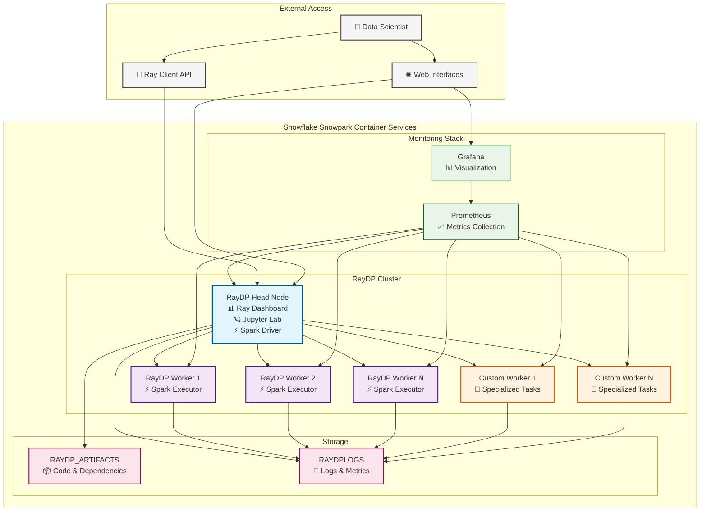

# Run distributed Spark on Ray using RayDP on SPCS

## Easy Setup via Streamlit in Snowflake


Once ready, just navigate to the URLs.

## RayDP Architecture

RayDP (Ray Data Processing) enables running Apache Spark on Ray clusters, providing a unified framework for distributed data processing and machine learning workloads on Snowflake Snowpark Container Services.


Mermaid.live visualization below:


### Components

**RayDP Head Node**
- Manages the Ray cluster and acts as the Spark driver
- Provides Jupyter Lab interface for interactive development
- Exposes Ray Dashboard for cluster monitoring
- Handles job scheduling and resource allocation

**RayDP Workers**
- Execute distributed Spark tasks and Ray actors
- Scalable compute nodes for data processing workloads
- Connect to head node for task coordination

**Custom Workers**
- Specialized worker nodes with custom resource allocations
- Optimized for specific workloads (e.g., GPU tasks, memory-intensive operations)
- Provides flexibility for heterogeneous compute requirements

**Monitoring Stack**
- **Prometheus**: Collects metrics from all cluster components
- **Grafana**: Provides visualization dashboards for cluster health and performance

**Storage**
- **RAYDP_ARTIFACTS**: Stores application code, dependencies, and configurations
- **RAYDPLOGS**: Centralized logging for debugging and audit trails

### Key Features
- **Unified Interface**: Run Spark and Ray workloads on the same cluster
- **Auto-scaling**: Dynamic compute pool scaling based on workload demands
- **Multi-tenant**: Isolated workspaces within Snowflake environment
- **Enterprise Security**: Built-in Snowflake security and governance
- **Cost Optimization**: Pay-per-use model with automatic resource suspension

## Testing Multi-Node Distribution

To verify that your RayDP setup properly utilizes all nodes (head + workers), use the provided test tools:

### 📊 Interactive Jupyter Notebook Test
```bash
# Upload and run the comprehensive test notebook
examples/raydp_distributed_test.ipynb
```

This notebook provides detailed analysis of:
- Node distribution verification
- CPU-intensive task distribution
- Persistent actor placement
- RayDP Spark workload distribution
- Concurrent Ray + Spark operations
- Resource-specific task placement

### 🚀 Command-Line Tests

**Simple Distribution Test (Recommended):**
```bash
# Quick test focusing on node utilization
python examples/simple_distributed_test.py

# Longer test duration
python examples/simple_distributed_test.py --duration 60

# Ray-only test (skip Spark)
python examples/simple_distributed_test.py --skip-spark
```

**Advanced Stress Test:**
```bash
# Full stress test (60 seconds)
python examples/raydp_stress_test.py

# Custom configuration
python examples/raydp_stress_test.py --duration 120 --tasks-per-node 8 --matrix-size 1000
```

**Executor Detection Test:**
```bash
# Test Spark executor detection methods
python examples/spark_executor_checker.py
```

### 🔍 Monitoring During Tests

**Monitor CPU usage on ALL nodes during tests:**
```bash
# On each node, run:
htop           # Interactive process viewer
top            # System monitor
iostat -x 1    # I/O statistics
vmstat 1       # Virtual memory statistics
```

**Expected Results:**
- ✅ All nodes should show high CPU usage (80-100%)
- ✅ Tasks distributed across all hostnames
- ✅ Both Ray tasks and Spark executors active
- ✅ Network traffic between nodes

**If only head node is active:**
- Check Ray cluster connectivity
- Verify worker node resources
- Increase task parallelism
- Check firewall/network configuration

### 🐛 Common Issues

**Spark Executor Detection Errors:**
- `'StatusTracker' object has no attribute 'getExecutorInfos'` - Use `simple_distributed_test.py` instead
- Spark version compatibility issues - Use the `spark_executor_checker.py` to test available methods
- Missing executor information - Check Spark UI at `http://head-node:4040` manually

**Distribution Problems:**
- All tasks run on head node only - Increase task count beyond head node CPU capacity
- Workers not joining - Check Ray worker logs and network connectivity
- Resource constraints - Verify worker nodes have sufficient CPU/memory resources

## Prerequisities
    - Snowpark Container Services
    - Docker

## Step by Step guide
1. Ask the accountadmin to run the script `step0_admin_setup.sql`. This will create a custom role RAYDP_SIS_ROLE
2. Using the custom role RAYDP_SIS_ROLE, execute the statements in `step1_user_setup.sql`
3. Update params inside `config.env`, 
    ```
    SS_DB=raydp_sis_db
    SS_SCHEMA=raydp_sis_core_schema
    SS_STAGE=RAYDP_YAMLSPECS
    IMAGE_REGISTRY=sfsenorthamerica-demo391.registry.snowflakecomputing.com/raydp_sis_db/raydp_sis_core_schema/raydp_sis_image_repo
    ```
4. Now on the same terminal, also run `sh build_image.sh` 
6. Now on SnowSight, switch to the RAYDP_SIS_ROLE role. Now, create a streamlit in snowflake app using the contents in `sis.py`. Use the database name `raydp_sis_db`, schema name `raydp_sis_core_schema` and warehouse name `RAYDP_SIS_XSW` for this streamlit in snowflake app. Execute the app.