# Run distributed Spark on Ray using RayDP on SPCS

## Easy Setup via Streamlit in Snowflake


Once ready, just navigate to the URLs.

## RayDP Architecture

RayDP (Ray Data Processing) enables running Apache Spark on Ray clusters, providing a unified framework for distributed data processing and machine learning workloads on Snowflake Snowpark Container Services.

Mermaid.live visualization below:

```mermaid
graph TB
    subgraph "Snowflake Snowpark Container Services"
        subgraph "RayDP Cluster"
            RH["RayDP Head Node<br/>📊 Ray Dashboard<br/>🪐 Jupyter Lab<br/>⚡ Spark Driver"]
            RW1["RayDP Worker 1<br/>⚡ Spark Executor"]
            RW2["RayDP Worker 2<br/>⚡ Spark Executor"]  
            RWN["RayDP Worker N<br/>⚡ Spark Executor"]
            CW1["Custom Worker 1<br/>🎯 Specialized Tasks"]
            CW2["Custom Worker N<br/>🎯 Specialized Tasks"]
        end
        
        subgraph "Monitoring Stack"
            PROM["Prometheus<br/>📈 Metrics Collection"]
            GRAF["Grafana<br/>📊 Visualization"]
        end
        
        subgraph "Storage"
            STAGE1["RAYDP_ARTIFACTS<br/>📦 Code & Dependencies"]
            STAGE2["RAYDPLOGS<br/>📝 Logs & Metrics"]
        end
    end
    
    subgraph "External Access"
        USER["👤 Data Scientist"]
        API["🔌 Ray Client API"]
        WEB["🌐 Web Interfaces"]
    end
    
    RH --> RW1
    RH --> RW2 
    RH --> RWN
    RH --> CW1
    RH --> CW2
    
    RH --> STAGE1
    RH --> STAGE2
    RW1 --> STAGE2
    RW2 --> STAGE2
    RWN --> STAGE2
    CW1 --> STAGE2
    CW2 --> STAGE2
    
    PROM --> RH
    PROM --> RW1
    PROM --> RW2
    PROM --> RWN
    PROM --> CW1
    PROM --> CW2
    
    GRAF --> PROM
    
    USER --> API
    API --> RH
    USER --> WEB
    WEB --> RH
    WEB --> GRAF
    
    classDef headNode fill:#e1f5fe,stroke:#01579b,stroke-width:3px
    classDef workerNode fill:#f3e5f5,stroke:#4a148c,stroke-width:2px
    classDef customNode fill:#fff3e0,stroke:#e65100,stroke-width:2px
    classDef monitoring fill:#e8f5e8,stroke:#1b5e20,stroke-width:2px
    classDef storage fill:#fce4ec,stroke:#880e4f,stroke-width:2px
    classDef external fill:#f5f5f5,stroke:#424242,stroke-width:2px
    
    class RH headNode
    class RW1,RW2,RWN workerNode
    class CW1,CW2 customNode
    class PROM,GRAF monitoring
    class STAGE1,STAGE2 storage
    class USER,API,WEB external
```


### Components

**RayDP Head Node**
- Manages the Ray cluster and acts as the Spark driver
- Provides Jupyter Lab interface for interactive development
- Exposes Ray Dashboard for cluster monitoring
- Handles job scheduling and resource allocation

**RayDP Workers**
- Execute distributed Spark tasks and Ray actors
- Scalable compute nodes for data processing workloads
- Connect to head node for task coordination

**Custom Workers**
- Specialized worker nodes with custom resource allocations
- Optimized for specific workloads (e.g., GPU tasks, memory-intensive operations)
- Provides flexibility for heterogeneous compute requirements

**Monitoring Stack**
- **Prometheus**: Collects metrics from all cluster components
- **Grafana**: Provides visualization dashboards for cluster health and performance

**Storage**
- **RAYDP_ARTIFACTS**: Stores application code, dependencies, and configurations
- **RAYDPLOGS**: Centralized logging for debugging and audit trails

## Prerequisities
    - Snowpark Container Services
    - Docker

## Step by Step guide
1. Ask the accountadmin to run the script `step0_admin_setup.sql`. This will create a custom role RAYDP_SIS_ROLE
2. Using the custom role RAYDP_SIS_ROLE, execute the statements in `step1_user_setup.sql`
3. Update params inside `config.env`, 
    ```
    SS_DB=raydp_sis_db
    SS_SCHEMA=raydp_sis_core_schema
    SS_STAGE=RAYDP_YAMLSPECS
    IMAGE_REGISTRY=sfsenorthamerica-demo391.registry.snowflakecomputing.com/raydp_sis_db/raydp_sis_core_schema/raydp_sis_image_repo
    ```
4. Now on the same terminal, also run `sh build_image.sh` 
6. Now on SnowSight, switch to the RAYDP_SIS_ROLE role. Now, create a streamlit in snowflake app using the contents in `sis.py`. Use the database name `raydp_sis_db`, schema name `raydp_sis_core_schema` and warehouse name `RAYDP_SIS_XSW` for this streamlit in snowflake app. Execute the app.